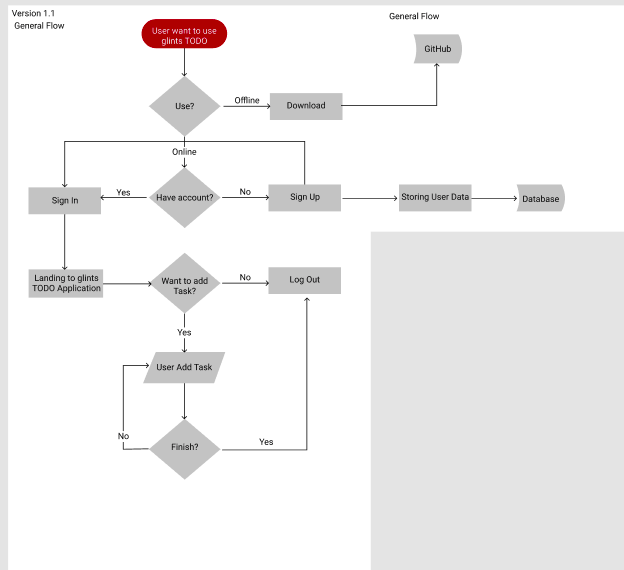

# glints TODO

---
## Description

Glints TODO is an application(for now its still prototype) for remind your daily task. It's still under development by myself. Part of my small-project

## Flowchart

[Flochart with Figma](https://www.figma.com/file/aUf5TpfAwhBerhkIyNDZ7BAr/glints-todo-flowchart?node-id=0%3A1) 

---
## How to Use it?
You need to create an account, after that you need to **Login** to use _glints TODO_ from this [website](https://nobody.netlify.com). But you also can download from my github repository or click **Download** button.

### Upcoming Feature

* Nightmode
* Reminder

### Development

* Desktop version

---

## LICENSE
MIT License

## Member and Author Info

* Arie Brainware

Contact me if you have a suggestion or problem

[twitter](@_nobody404)

[email](publicu002[at]gmail.com)
